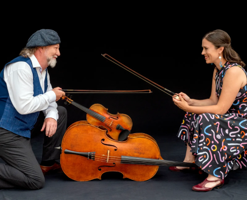

## EL ESPÍRITU CRISOL

Por Espíritu Crisol entendemos todas las ideas y conceptos que nos han llevado a organizar un encuentro de estas características y la **pasión por la música** es el motivo principal.

Quien no esté familiarizado con el término **fiddle** debe saber que no se trata de un instrumento diferente al violín (en lo que a forma se refiere) pero sí en cuanto a lenguaje musical. Es una manera de comprender las posibilidades de expresión de nuestro instrumento diferente a la clásica y se puede extrapolar a cualquier instrumento. No es simplemente tocar el violín folk, es **hablar con el alma** a través de él, independientemente del estilo musical.

Nuestro objetivo es realizar un curso en el que todo el mundo pueda aprender a amar la música por encima de todo. Lo hacemos rechazando la competitividad que muchas veces lleva implícito el aprendizaje y dominio de un instrumento.

En el curso habrá niveles de aprendizaje distintos, pero todo el mundo podrá interactuar entre si, sea principiante o profesional. Las diferencias de nivel técnico o de conocimientos nunca supondrán una barrera entre las personas porque la música es mucho más que eso: es compartir, crecer y enriquecerse juntos. Nuestra propuesta se basa en la apertura e inclusividad.

 

El Alma Mater del curso es [Alasdair Fraser](https://www.alasdairfraser.com/), uno de los mejores violinistas folk del mundo, un didacta dedicado y motivador nato, que lleva más de treinta años dirigiendo proyectos similares en Escocia (Sabhal Mòr Ostaig), California ([Valley of the Moon Fiddle Camp](http://www.valleyofthemoon.org/) y [Sierra Fiddle Camp](http://www.sierrafiddlecamp.org/)) y Australia ([Stringmania!](https://www.stringmaniacamp.com/)).

Contamos también con [Natalie Haas](https://www.nataliehaas.com/), una violonchelista que sorprende por su frescura, creatividad y gusto. Desde el 2004, Natalie acompaña en gira a Alasdair y enseña en los cursos mencionados. Juntos han publicado ya 6 trabajos discográficos. Sus clases tienen cada vez más adeptos y se puede decir que es la impulsora de un movimiento que saca al violonchelo del encorsetamiento orquestal, llevándolo a un terreno en que el acompañamiento rítmico y armónico son protagonistas.

Ya que la música no tiene fronteras, cada año invitamos a músicos de otras latitudes para que nos acerquen sus tradiciones, nos permitan aprender de sus habilidades y enriquecernos como músicos y personas. También hemos incorporado, cada vez con más solidez, el baile y la voz, elementos comunes y esenciales en cualquier tradición.
